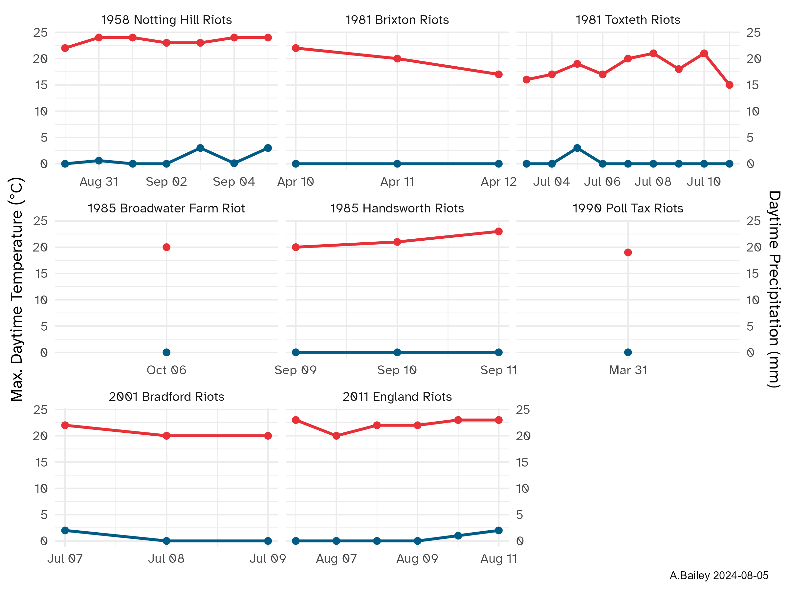

# Plot of the Weather on the days of UK Riots from 1958 to 2011

Weather data from Met Office Daily Weather Reports:
https://www.metoffice.gov.uk/research/library-and-archive/publications/daily-weather-summary

Temperature is maximum daytime observation. Rainfall is daytime observation. 
For the England Riots I used
the median England temperature and rainfall as these riots occurred in multiple
locations. But it was essentially warm and dry throughout England in that period.

